# Booking App Project

* [Click see video](https://youtu.be/yEJOXoVfG30)


## images
<p align="center">
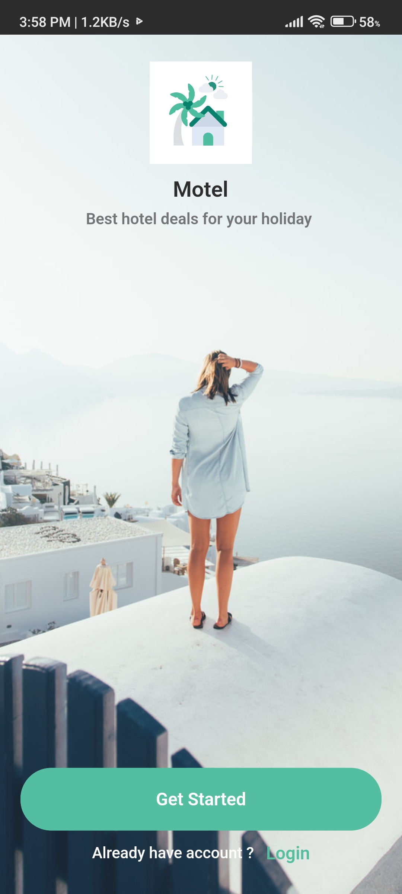</img>
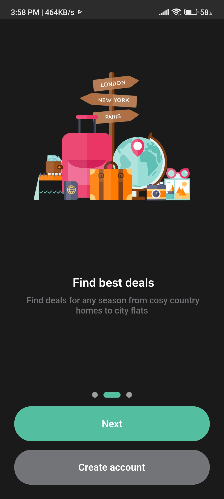</img>
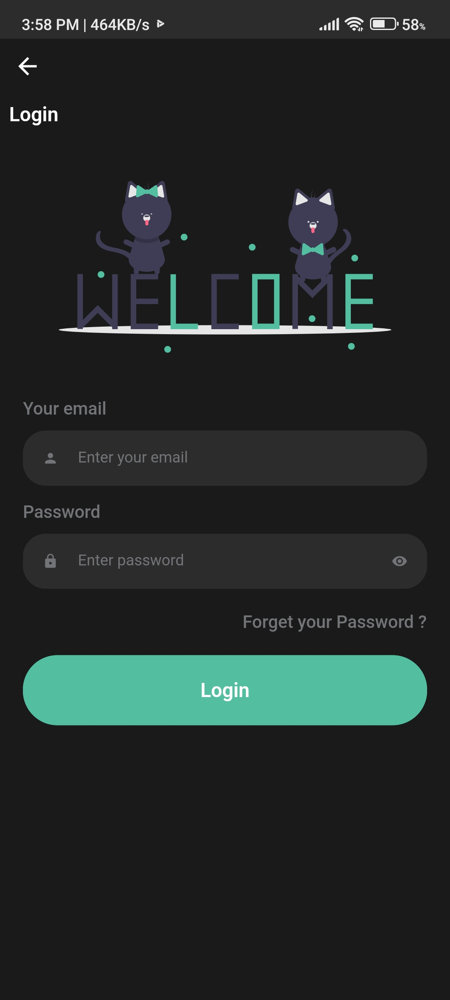
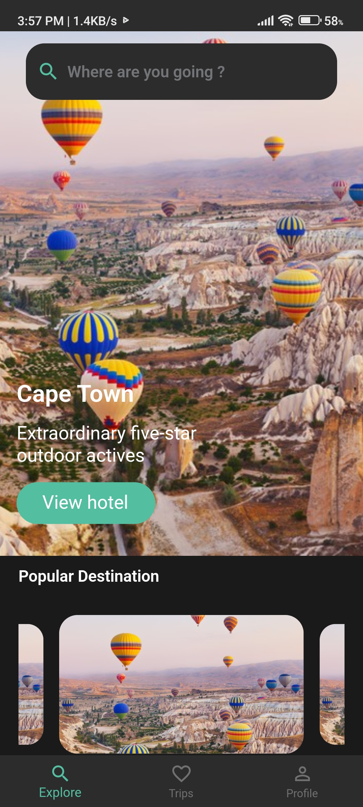
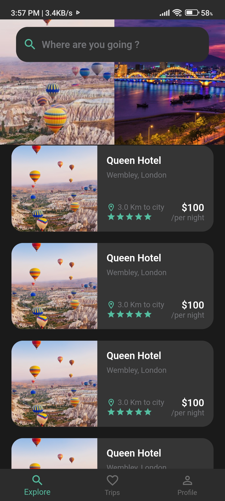
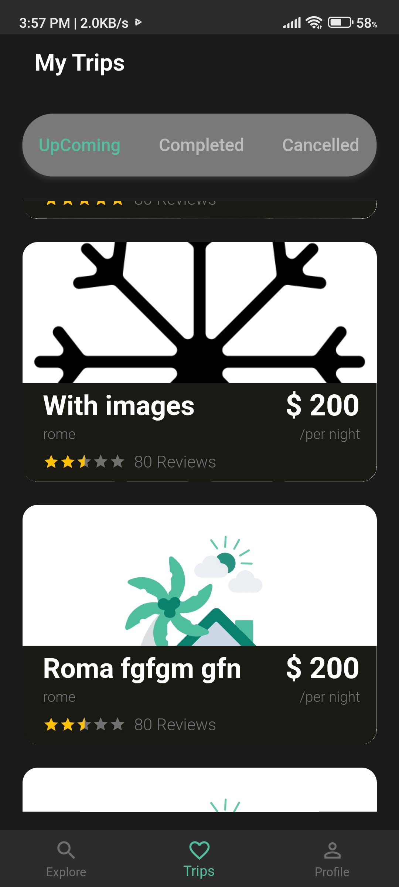
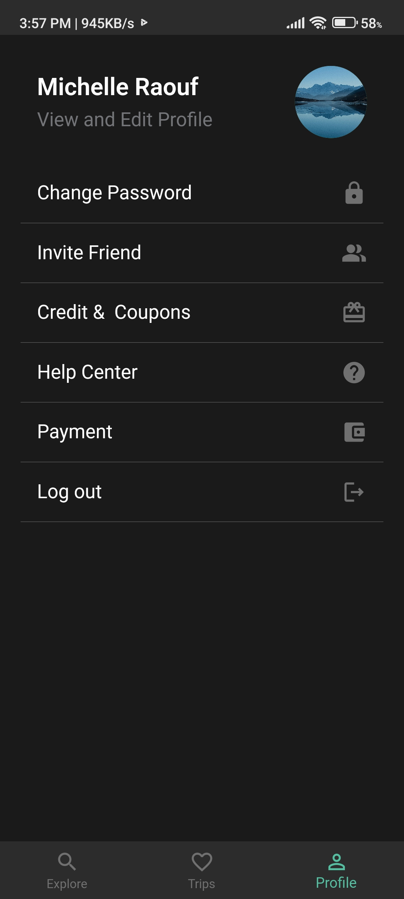
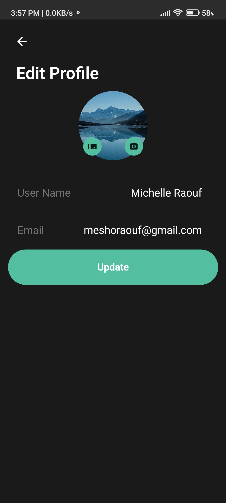
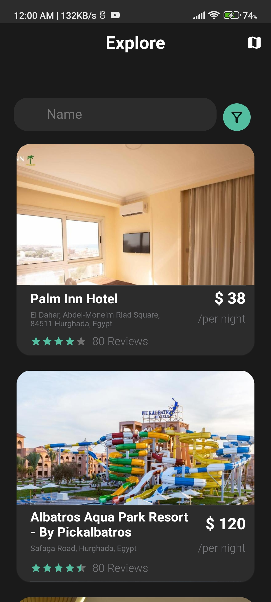
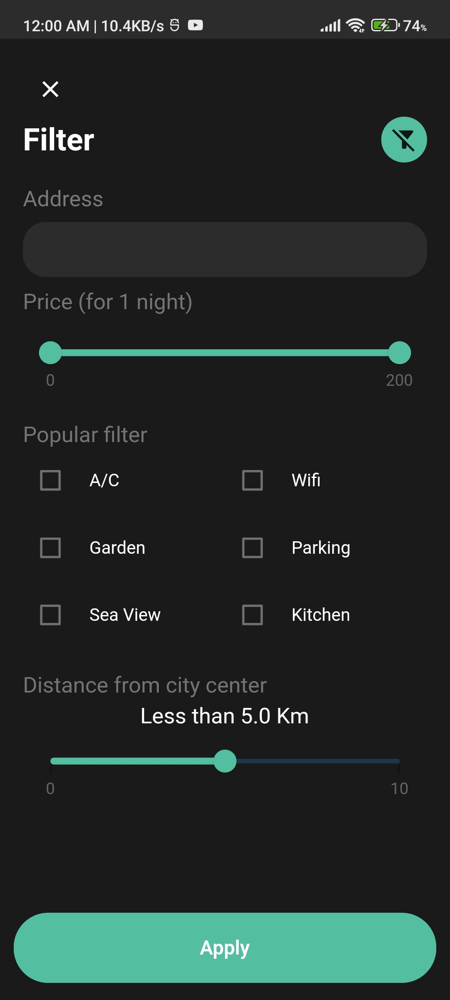
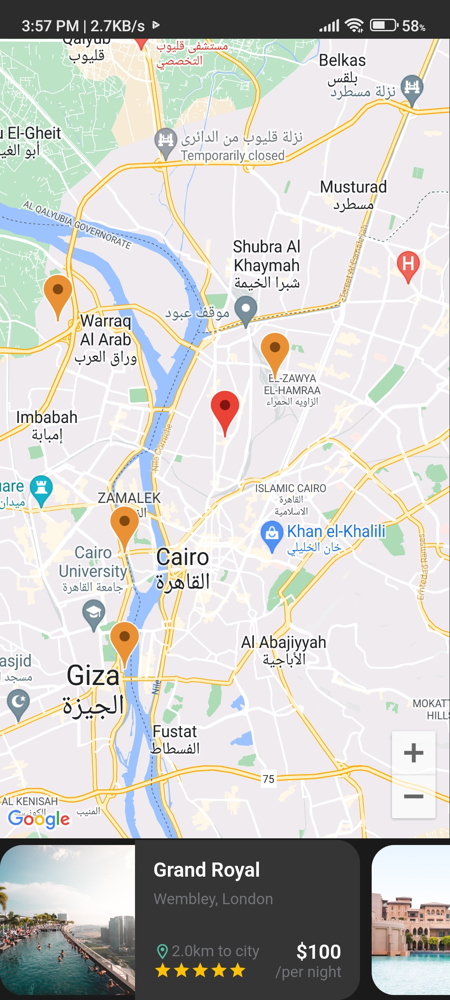
</p>


## Getting Started

A Booking App project created in flutter using Bloc . Booking App supports mobile, clone the appropriate branches mentioned below:

The Booking App contains the minimal implementation required to create a new library or project. The repository code is preloaded with some basic components like basic app architecture, app theme, constants and required dependencies to create a new project. By using boiler plate code as standard initializer, we can have same patterns in all the projects that will inherit it. This will also help in reducing setup & development time by allowing you to use same code pattern and avoid re-writing from scratch.

## How to Use 

**Step 1:**

Download or clone this repo by using the link below:

```
git clone https://github.com/the-best-is-best/booking_app.git
```

**Step 2:**

Go to project root and execute the following command in console to get the required dependencies: 

```
flutter pub get 
```

**Step 3:**

This project uses `inject` library that works with code generation, execute the following command to generate files:

```
flutter packages pub run build_runner build --delete-conflicting-outputs
```

or watch command in order to keep the source code synced automatically:

```
flutter packages pub run build_runner watch
```


## Booking App Features:

* Splash
* Login
* Home
* Routing
* Theme
* Dio
* retrofit
* json_annotation
* freezed
* GetStorage
* Bloc
* Email validator
* Code Generation
* Pretty dio logger
* Dependency Injection
* google maps
* geolocator
* geocoding
* polyline map
* dartz
* cached network image
* svg
* screen util

### Folder Structure
Here is the core folder structure which flutter provides.

```
flutter-app/
|- android
|- build
|- ios
|- lib
```

Here is the folder structure we have been using in this project

```
lib/app/
       |- data/
       |- network/
       |- constant/
       |- di/
       |- extension/
lib/core/
       |- services/
       |- utils/
            |- assets
            |- colors
            |- fonts
            |- strings
            |- themes
 
   |- Features
       |- data/ data layer
       |- domain/ domain layer
       |- data/ data layer
       |-presentation/ presentation layer
    
```